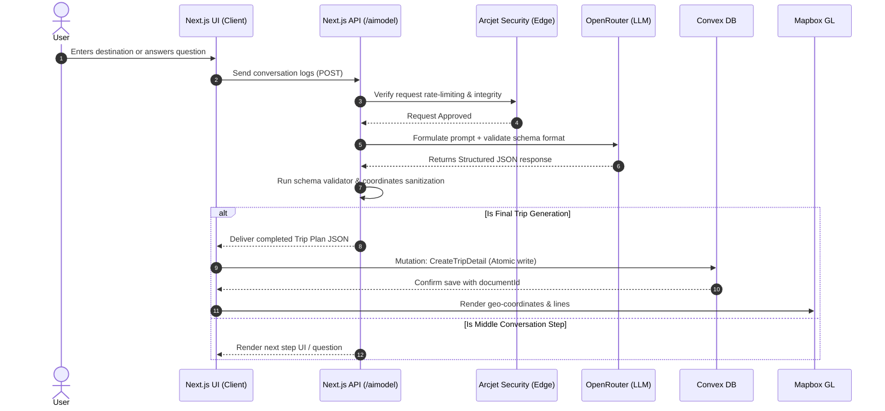

# <div align="center">⚔️ Zoro Trip Planner</div>

<div align="center">
  <p><strong>AI-Powered Travel Intelligence Engine</strong></p>
  <p>An intelligent, conversational trip planner that turns travel dreams into detailed, interactive itineraries, budget-aligned stays, and geographic maps in seconds.</p>
</div>

<div align="center">

[](https://nextjs.org)
[](https://www.typescriptlang.org)
[](https://tailwindcss.com)
[](https://convex.dev)
[](https://clerk.dev)
[](https://arcjet.com)

</div>

---

## 📖 Introduction

**Zoro** is a modern, conversation-driven travel planning application. Instead of filling out rigid, static forms, Zoro uses a multi-turn conversational AI agent to gather your preferences (destination, origin, group size, budget, and travel duration). 

Once the preferences are finalized, the engine generates a seamless, gap-free day-by-day travel itinerary complete with geocoded activities, budget-calibrated lodging recommendations, and interactive map routes.

---

## 🚀 Key Features

*   💬 **Conversational Planning Agent**: Interacts with the user dynamically. Prompts for missing parameters (budget, origin, duration) incrementally and automatically transitions the client interface when ready.
*   🗺️ **Interactive Geographic Map**: Renders full path lines and coordinates of daily activities and lodging on a dynamic **Mapbox GL** canvas.
*   🛡️ **Edge-Level Security (Arcjet)**: Active protection against API abuse, bot scraping, and brute force requests via Arcjet's Next.js integration.
*   💾 **Reactive Database Layer**: Syncs and coordinates trip state in real time using **Convex Mutations, Queries, and Schemas**.
*   🧬 **Fault-Tolerant Data Sanitization**: Strict JSON verification on AI responses to automatically repair invalid schemas, replace missing coordinates, and protect against application runtime crashes.
*   🎨 **Tailwind CSS v4 & Framer Motion UI**: Sleek, modern look with glassmorphic cards, responsive grid structures, dark-mode styling, and smooth layout transitions.

---

## 📐 Architecture & Data Flow

Below is the flow representation showing how user input is processed, secured, enhanced, and saved:



---

## 🛠️ Tech Stack Matrix

| Layer | Technology | Key Purpose |
| :--- | :--- | :--- |
| **Framework** | [Next.js 16](https://nextjs.org/) | App Router, Server Actions, and API Route handling |
| **Database** | [Convex](https://convex.dev/) | Realtime document storage, reactive queries, and TypeScript schema validation |
| **Auth** | [Clerk](https://clerk.dev/) | Secure user management, session handling, and OAuth provider integrations |
| **Security** | [Arcjet](https://arcjet.com/) | Edge rate limiting, bot protection, and request verification |
| **Maps** | [Mapbox GL](https://www.mapbox.com/) | WebGL interactive travel routes, marker tracking, and map rendering |
| **Styles** | [Tailwind CSS v4](https://tailwindcss.com/) | Modern layout engine with clean custom variables and utility rules |
| **Inference** | [OpenRouter](https://openrouter.ai/) | High-speed LLM processing (using GPT-4o-mini & custom parameters) |

---

## 📂 Codebase Tour

```text
Zoro-trip-planner/
├── app/                           # Next.js App Router root
│   ├── (auth)/                    # Sign-in and registration pages
│   ├── _components/               # Homepage parts (Hero, Features, CTABanner)
│   ├── api/                       # API Route definitions
│   │   ├── aimodel/               # LLM interaction route & validation endpoint
│   │   └── google-place-detail/   # Fetches place image resources
│   ├── create-new-trip/           # Conversational planner UI and Map workspace
│   ├── my-trips/                  # User trip storage panel
│   └── view-trips/                # Detailed trip viewer page
├── components/                    # Sharable UI primitives & UI cards
│   ├── ui/                        # Button, input, and basic interface elements
│   └── workspace/                 # Workspace tabs (Map, Itinerary, Insights)
├── convex/                        # Convex backend definition
│   ├── _generated/                # Auto-compiled client APIs
│   ├── schema.ts                  # UserTable and TripDetailTable schemas
│   ├── tripDetail.ts              # Mutations and queries to insert, load, & delete trips
│   └── user.ts                    # Syncs authenticated Clerk profiles to database
└── lib/                           # Helper utilities & core services
    ├── ai-data-validator.ts       # Parses, sanitizes, and repairs LLM JSON output
    ├── database-validation.ts     # Schema-level Convex validators
    ├── database-types.ts          # Strongly typed query contracts
    └── application-types.ts       # Central source of truth for TypeScript interfaces
```

---

## 💻 Local Setup & Installation

Follow these steps to run Zoro Trip Planner locally:

### 1. Prerequisites
- **Node.js** v20.x or higher
- An active account on [Clerk](https://clerk.com), [Convex](https://convex.dev), [Mapbox](https://mapbox.com), [OpenRouter](https://openrouter.ai), and [Arcjet](https://arcjet.com) to obtain API keys.

### 2. Clone the Repository
```bash
git clone https://github.com/yourusername/zoro-trip-planner.git
cd zoro-trip-planner
```

### 3. Install Dependencies
```bash
npm install
```

### 4. Configure Environment Variables
Create a `.env.local` file in the root directory and append your credentials:

```ini
# Clerk Authentication Keys
NEXT_PUBLIC_CLERK_PUBLISHABLE_KEY=pk_test_...
CLERK_SECRET_KEY=sk_test_...

# Google Places API Key (for retrieving location data)
GOOGLE_PLACE_API_KEY=AIzaSy...

# Mapbox GL Public Token (for interactive map view)
NEXT_PUBLIC_MAPBOX_ACCESS_TOKEN=pk.eyJ1...

# Convex URL (automatically set up after running `npx convex dev`)
NEXT_PUBLIC_CONVEX_URL=https://...convex.cloud

# LLM Inference
OPENROUTER_API_KEY=sk-or-v1-...

# Edge Security & Rate Limiting
ARCJET_KEY=ajkey_...
```

### 5. Initialize the Convex Database Dev Server
Convex runs a real-time dev environment to compile schema files and sync database tables. Start it in a separate terminal:
```bash
npx convex dev
```
*Note: This command will guide you through logging in to Convex and will automatically set up `NEXT_PUBLIC_CONVEX_URL` inside your `.env.local`.*

### 6. Spin Up the Next.js Client
Once the Convex environment is active, start your local Next.js server:
```bash
npm run dev
```

Open [http://localhost:3000](http://localhost:3000) inside your browser to start planning!

---

## 🛡️ Security & Reliability Policies

### Data Resilience
To guarantee that the workspace renders correctly even if the LLM output is truncated or slightly formatted incorrectly:
1. **Fallback Structures**: If the API receives a partial itinerary, `createFallbackTripData` runs immediately to create placeholder keys.
2. **Coordinate Sanitizer**: `sanitizeCoordinates` converts missing coordinates safely to fallback points to prevent Mapbox GL map initialization failures.
3. **Type Guards**: Application types are enforced at runtime via `isValidTrip` and `isValidMessage` checkers before state mutation.

### API Shielding
Arcjet blocks scrapers, tracks request rates, and denies access to clients generating unnatural volume of AI generation events.

---

## 📄 License

This project is licensed under the [MIT License](LICENSE).